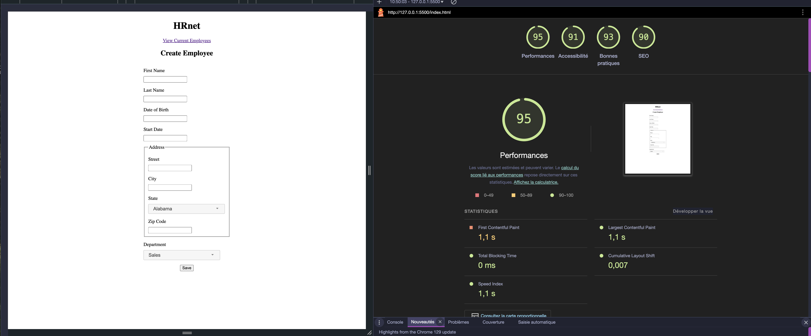
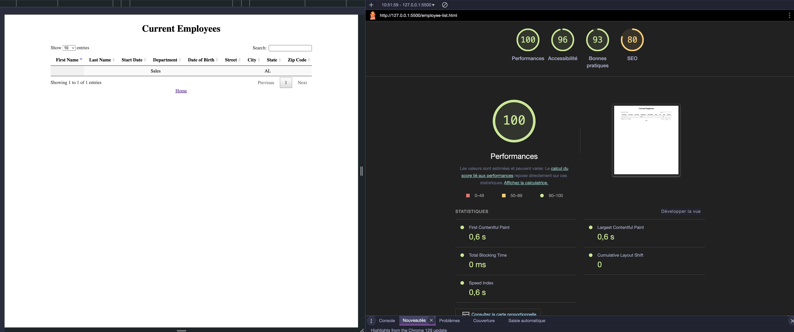
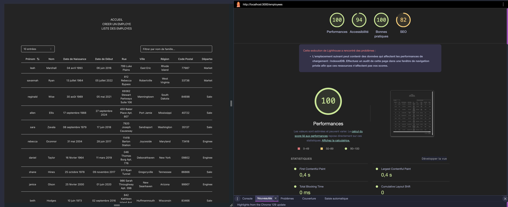
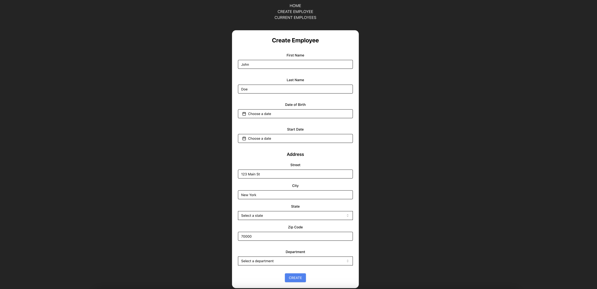
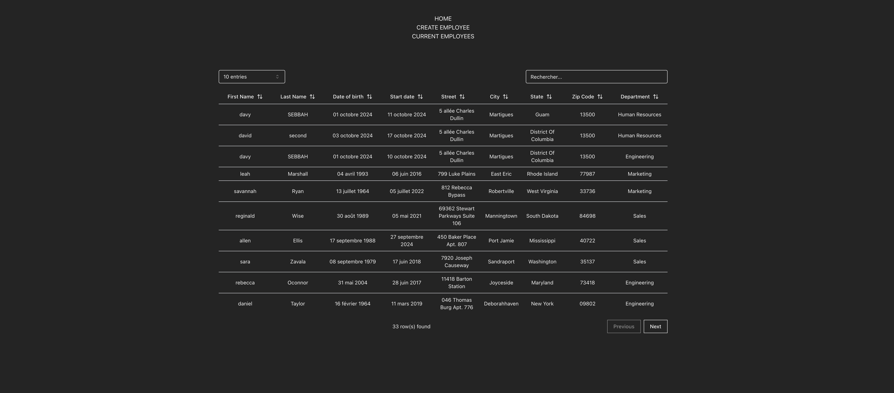
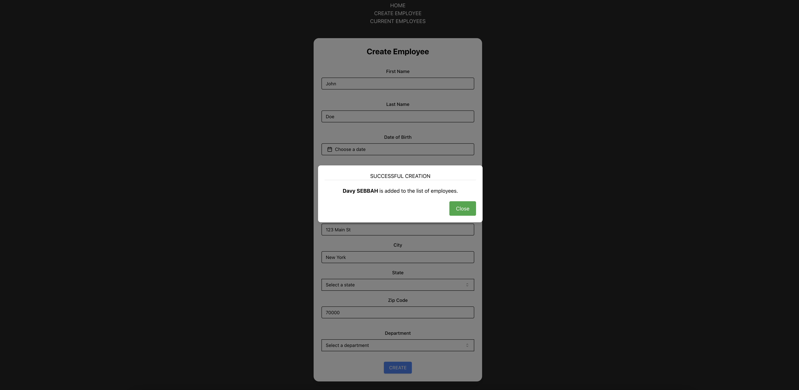

# HRnet - Migration vers React

Ce projet est une refonte complète de l'application HRnet, qui avait été initialement développée en **jQuery**. Nous avons modernisé l'application en la migrant vers **React**, en y intégrant un plugin de modale personnalisable et en améliorant les fonctionnalités globales de l'application.

## Synthèse du Projet

### Contexte

HRnet est une application web de gestion des employés. L'objectif de ce projet de refonte était de moderniser le code, rendre l'application plus maintenable et performante, tout en introduisant de nouvelles fonctionnalités et en améliorant l'expérience utilisateur.

### Pages Modernisées

- **Page d'Accueil HRnet** :
  - La page d'accueil introduit le projet et propose une navigation vers les différentes sections de l'application via **React Router**.

- **Page de Création d'un Employé** :
  - Un formulaire simple permet d'ajouter un nouvel employé.
  - Une **modale personnalisée** s'ouvre lors de la soumission du formulaire pour confirmer l'ajout.

- **Page de la Liste des Employés** :
  - Affiche la liste des employés avec des fonctionnalités de tri, filtrage, et pagination.
  - L'intégration de **React Table** permet une gestion efficace et interactive des données.

  ### Comparaison des Performances Lighthouse

Pour illustrer l'impact de la modernisation de l'application, nous avons effectué une comparaison des performances Lighthouse entre l'ancienne version et la version modernisée de notre application. Les résultats sont présentés ci-dessous pour les deux pages clés : la page de création d'un employé et la page de la liste des employés.

#### Page de Création d'un Employé

| Ancienne Version | Nouvelle Version |
|------------------|------------------|
|  |  |

#### Page de la Liste des Employés

| Ancienne Version | Nouvelle Version |
|------------------|------------------|
|  |  |


## Plugin de Modale Personnalisée

Nous avons développé un plugin de **modale réutilisable** en React, qui remplace les anciennes boîtes de dialogue jQuery. Ce composant est personnalisable, permettant d'ajuster les boutons, les styles, et les actions via des propriétés (`props`).

## Installation du Plugin de Modale

Pour utiliser le plugin de modale personnalisé dans ce projet React, vous pouvez l'installer via npm :

```bash
npm install @davy-dev/react-modal-plugin
```

## Bibliothèques et Outils Utilisés

### Dépendances Principales
- **@davy-dev/react-modal-plugin** : Plugin de modale personnalisée.
- **@hookform/resolvers** : Résolveur de schémas pour React Hook Form.
- **@tanstack/react-table** : Gestion des tables réactives avec pagination et filtrage.
- **react-router-dom** : Navigation et gestion des routes côté client.
- **zod** : Validation des schémas de données.

### UI et CSS
- **TailwindCSS** : Framework de styles CSS utilitaire qui facilite la gestion des styles en utilisant une approche utilitaire. Il permet de créer des interfaces réactives et modulables.
- **Radix UI** : Composants UI accessibles pour React, assurant que les éléments d'interface utilisateur respectent les normes d'accessibilité. Ces composants sont facilement personnalisables.
- **ShadCN UI** : Une collection de composants UI qui combine **Radix UI** pour l'accessibilité et **TailwindCSS** pour la stylisation, offrant ainsi des composants modernes, flexibles et accessibles.
- **lucide-react** : Icônes personnalisables pour React.

### Formulaires et Dates
- **react-hook-form** : Gestion des formulaires réactifs, permettant de simplifier la collecte et la validation des données des utilisateurs.
- **date-fns** : Bibliothèque pour la manipulation et le formatage des dates en JavaScript.

### Outils de Développement
- **vite** : Bundler et serveur de développement ultra-rapide, optimisé pour les projets React et TypeScript.
- **eslint** : Outil de linting pour maintenir une qualité de code et garantir une cohérence dans le formatage.
- **typescript** : Langage de programmation typé pour JavaScript, apportant sécurité et robustesse dans le code.

## Installation et Lancement du Projet

### Cloner le Projet
Tout d'abord, clonez le projet depuis le dépôt GitHub :

```bash
git clone https://github.com/DavyHaYehoudi/convert-to-react
```
### Accéder au Dossier du Projet
Déplacez-vous dans le dossier du projet cloné :

```bash
cd converting-to-react
```

### Installer les Dépendances
```bash
npm install
```
Ou 
```bash
yarn install
```

### Lancer l'Application en Mode Développement
```bash
npm run dev
```
ou
```bash
yarn dev
```
### Générer le Build pour la Production
```bash
npm run build
```
ou
```bash
yarn build
```

## Illustration du Projet

### Page d'Accueil


### Formulaire de Création d'Employé



### Liste des Employés



### Exemple de Modale



