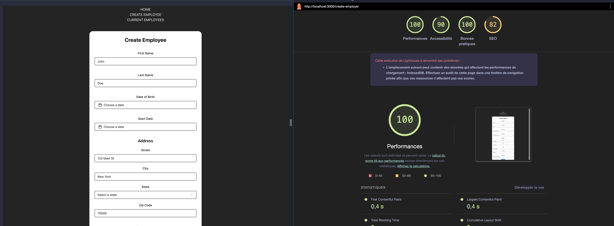
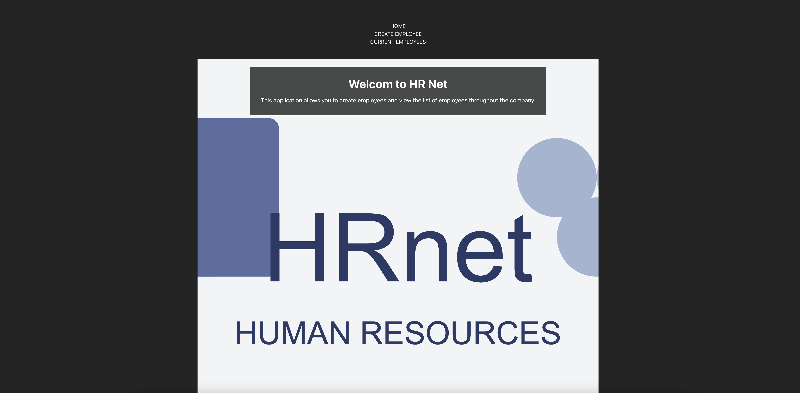

# HRnet - Migration to React

This project is a complete redesign of the HRnet application, which was initially developed using **jQuery**. We modernized the application by migrating it to **React**, integrating a customizable modal plugin, and improving the overall functionality of the application.

## Project Summary

### Background

HRnet is a web application for employee management. The goal of this redesign project was to modernize the code, make the application more maintainable and performant, while introducing new features and enhancing the user experience.

### Modernized Pages

- **HRnet Home Page**:
  - The home page introduces the project and provides navigation to the various sections of the application via **React Router**.

- **Employee Creation Page**:
  - A simple form allows adding a new employee.
  - A **custom modal** opens upon form submission to confirm the addition.

- **Employee List Page**:
  - Displays the list of employees with sorting, filtering, and pagination features.
  - The integration of **React Table** enables efficient and interactive data management.

### Lighthouse Performance Comparison

To illustrate the impact of modernizing the application, we performed a Lighthouse performance comparison between the old version and the modernized version of our application. The results are presented below for the two key pages: the employee creation page and the employee list page.

#### Employee Creation Page

| Old Version | New Version |
|-------------|-------------|
|  |  |

#### Employee List Page

| Old Version | New Version |
|-------------|-------------|
|  |  |


## Custom Modal Plugin

We developed a **reusable modal plugin** in React, which replaces the old jQuery dialog boxes. This component is customizable, allowing adjustments to buttons, styles, and actions via properties (`props`).

## Installation of the Modal Plugin

To use the custom modal plugin in this React project, you can install it via npm:

```bash
npm install @davy-dev/react-modal-plugin

```

## Libraries and Tools Used

### Main Dependencies
- **@davy-dev/react-modal-plugin**: Custom modal plugin.
- **@hookform/resolvers**: Schema resolver for React Hook Form.
- **@tanstack/react-table**: Reactive table management with pagination and filtering.
- **react-router-dom**: Client-side routing and navigation management.
- **zod**: Data schema validation.

### UI and CSS
- **TailwindCSS**: Utility-first CSS framework that simplifies style management using a utility approach. It allows the creation of responsive and modular interfaces.
- **Radix UI**: Accessible UI components for React, ensuring that user interface elements comply with accessibility standards. These components are easily customizable.
- **ShadCN UI**: A collection of UI components that combines **Radix UI** for accessibility and **TailwindCSS** for styling, providing modern, flexible, and accessible components.
- **lucide-react**: Customizable icons for React.

### Forms and Dates
- **react-hook-form**: Reactive form management, simplifying user data collection and validation.
- **date-fns**: Library for manipulating and formatting dates in JavaScript.

### Development Tools
- **vite**: Ultra-fast bundler and development server optimized for React and TypeScript projects.
- **eslint**: Linting tool to maintain code quality and ensure consistency in formatting.
- **typescript**: Typed programming language for JavaScript, providing security and robustness in code.

## Installation and Launching the Project

### Clone the Project
First, clone the project from the GitHub repository:

```bash
git clone https://github.com/DavyHaYehoudi/convert-to-react
```
### Access the Project File
Move to the cloned project folder :

```bash
cd converting-to-react
```

### Install Dependencies
```bash
npm install
```
Ou 
```bash
yarn install
```

### Launch the Application in Development Mode
```bash
npm run dev
```
ou
```bash
yarn dev
```
### Generate the Build for Production
```bash
npm run build
```
ou
```bash
yarn build
```

## Project Illustration

### Home page



### Employee Creation Form


### List of Employees


### Example of Modal


